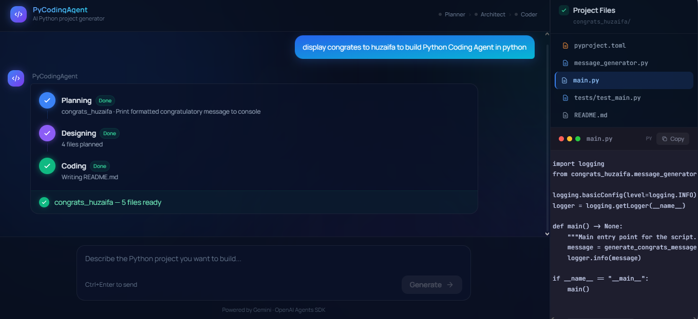

# PyCodingAgent

> An AI-powered assistant that converts natural language prompts into complete, production-ready Python projects using a pipeline of specialized agents — with a real-time chat UI and streaming progress updates.

---

## Live Demo

| Layer | Platform | URL |
|---|---|---|
| Frontend | Vercel | [python-coding-agent.vercel.app](https://python-coding-agent.vercel.app) |
| Backend API | Railway | [web-production-a02859.up.railway.app](https://web-production-a02859.up.railway.app) |
| API Docs | Railway | [/docs](https://web-production-a02859.up.railway.app/docs) |



### Try It Live

Open [python-coding-agent.vercel.app](https://python-coding-agent.vercel.app) and type any of these prompts:

```
Build a CLI tool that converts CSV files to JSON
```
```
FastAPI REST API with CRUD endpoints for a todo list
```
```
Web scraper that extracts news headlines from a URL
```
```
Data pipeline that reads, cleans, and exports CSV files
```

The AI team streams progress in real time — watch **Planner → Architect → Coder** complete each phase, then browse and copy the generated files directly in the UI.

---

## How It Works

```
User Prompt  (Chat UI or CLI)
     │
     ▼
InputGuardrail        ← blocks non-Python, vague, or dangerous prompts
     │
     ▼
Planner Agent         ← understands requirements → structured JSON plan
     │
     ▼
Architect Agent       ← designs file structure + implementation order
     │
     ▼
Coder Agent           ← generates complete production-ready source code
     │
     ▼
OutputGuardrail       ← rejects dangerous patterns, validates pyproject.toml
     │
     ▼
generated-projects/<name>/
```

Progress streams live to the UI via **Server-Sent Events (SSE)** — no polling, no page refresh.

---

## Example Output

**Prompt:** `Build a FastAPI REST API for a todo list`

**Generated project** `todo_api/`:

```
todo_api/
├── pyproject.toml                  # ruff, mypy, pytest, hatchling config
├── main.py                         # FastAPI app entry point
├── src/
│   └── todo_api/
│       ├── routes/todos.py         # typed route handlers
│       ├── models.py               # Pydantic models
│       └── services.py             # business logic
├── tests/
│   └── test_todos.py               # pytest test cases
└── README.md                       # uv sync + uv run instructions
```

---

## Supported Project Types

| Type | Description | Example |
|---|---|---|
| `script` | Single-file Python script | "Script that resizes all images in a folder" |
| `fastapi` | Async REST API | "FastAPI CRUD API for a blog" |
| `flask` | Lightweight web API | "Flask API that returns weather data" |
| `django` | Full-stack web app | "Django app with user auth and dashboard" |
| `cli` | Command-line tool | "CLI that converts CSV to JSON" |
| `library` | Reusable Python package | "Python library for date formatting" |
| `data-pipeline` | ETL / data processing | "Pipeline that cleans and exports CSV files" |
| `scraper` | Web scraper | "Scraper that extracts headlines from news sites" |

---

## Tech Stack

### AI Pipeline
| Tool | Role |
|---|---|
| [OpenAI Agents SDK](https://github.com/openai/openai-agents-python) | Agent orchestration |
| [Gemini API](https://ai.google.dev/) | LLM (via OpenAI-compatible endpoint) |
| [OpenAI API](https://platform.openai.com/) | Tracing only |

### Backend
| Tool | Role |
|---|---|
| [FastAPI](https://fastapi.tiangolo.com/) | REST API + SSE streaming |
| [uvicorn](https://www.uvicorn.org/) | ASGI server |
| [uv](https://docs.astral.sh/uv/) | Package manager |

### Frontend
| Tool | Role |
|---|---|
| [Next.js 16](https://nextjs.org/) | App Router, React 19 |
| [Tailwind CSS](https://tailwindcss.com/) | Utility-first styling |
| [Manrope](https://fonts.google.com/specimen/Manrope) + [JetBrains Mono](https://fonts.google.com/specimen/JetBrains+Mono) | Typography |

### Generated Project Stack
- Python 3.12+, Pydantic v2
- FastAPI / Flask / Django / Typer
- pytest, ruff, mypy, httpx, uv

---

## Project Structure

```
Python-Coding-Agent/
│
├── api/                            # FastAPI backend
│   ├── main.py                     # App entrypoint, CORS, routers
│   ├── job_store.py                # In-memory job store (asyncio.Queue)
│   ├── schemas.py                  # Pydantic request/response models
│   └── routes/
│       ├── generate.py             # POST /api/generate + GET SSE stream
│       └── projects.py             # GET project file listing + content
│
├── pipeline/
│   ├── planner_agent.py            # Analyzes prompt → structured JSON plan
│   ├── architect_agent.py          # Plan → file structure + order
│   ├── coder_agent.py              # Architecture → source code files
│   └── guardrails.py               # Input + output safety checks
│
├── lib/
│   ├── llm_client.py               # Gemini client configuration
│   └── orchestrator.py             # Chains agents, writes files, emits SSE events
│
├── models/
│   └── models.py                   # Pydantic models (PlannerOutput, ArchOutput, etc.)
│
├── ui/                             # Next.js frontend (Midnight Blueprint dark theme)
│   ├── app/
│   │   ├── layout.tsx              # Fonts, ambient orb background
│   │   ├── page.tsx                # Root page
│   │   └── globals.css             # Glass utilities, grain texture, animations
│   ├── components/
│   │   ├── ChatShell.tsx           # Main layout, SSE orchestration
│   │   ├── MessageList.tsx         # Chat history + empty state with suggestions
│   │   ├── MessageBubble.tsx       # User/assistant message bubbles
│   │   ├── AgentProgress.tsx       # Planner/Architect/Coder step indicators
│   │   ├── PromptInput.tsx         # Textarea + gradient Generate button
│   │   ├── FileTree.tsx            # Generated project file browser
│   │   └── CodeViewer.tsx          # Syntax-highlighted code panel (Catppuccin)
│   ├── lib/
│   │   ├── api.ts                  # fetch wrappers (startGenerate, getProjectFile)
│   │   └── sse.ts                  # EventSource wrapper with typed events
│   ├── types/index.ts              # Shared TypeScript types
│   └── .env.local.example          # Frontend env var template
│
├── generated-projects/             # All AI-generated projects land here
├── main.py                         # CLI entry point
├── test_agents.py                  # Agent output smoke test (no file writes)
├── Procfile                        # Railway start command
├── pyproject.toml                  # Python dependencies + tooling config
└── .env                            # API keys (not committed)
```

---

## Local Setup

### Prerequisites
- Python 3.13+
- [uv](https://docs.astral.sh/uv/getting-started/installation/)
- Node.js 20+

### 1. Clone and install

```bash
git clone https://github.com/EngrHuzi/Python-Coding-Agent.git
cd Python-Coding-Agent
uv sync
```

### 2. Configure environment

```bash
cp .env.example .env
```

Edit `.env`:

```env
GEMINI_API_KEY=your_gemini_api_key_here
MODEL_NAME=gemini-2.0-flash-lite
OPENAI_API_KEY=your_openai_api_key_here   # optional — for tracing only
```

Get your Gemini API key free at [aistudio.google.com/apikey](https://aistudio.google.com/apikey).

### 3. Run the backend

```bash
uvicorn api.main:app --reload --port 8000
```

### 4. Run the frontend

```bash
cd ui
cp .env.local.example .env.local
npm install
npm run dev
```

Open [http://localhost:3000](http://localhost:3000).

### 5. Or use the CLI directly

```bash
uv run python main.py "Build a CLI tool that converts CSV files to JSON"
```

---

## Deployment

### Frontend → Vercel

1. Import the GitHub repo at [vercel.com](https://vercel.com)
2. Set **Root Directory** to `ui`
3. Add environment variable:
   ```
   NEXT_PUBLIC_API_URL=https://your-backend.up.railway.app
   ```
4. Deploy — Vercel auto-deploys on every push to `main`

### Backend → Railway

1. Create new project at [railway.app](https://railway.app) from this GitHub repo
2. Add environment variables in the service **Variables** tab:
   ```
   GEMINI_API_KEY=your_gemini_key
   MODEL_NAME=gemini-2.0-flash-lite
   ```
3. Railway reads the `Procfile` and starts the server automatically:
   ```
   web: uvicorn api.main:app --host 0.0.0.0 --port $PORT
   ```
4. Generate a public domain under **Settings → Networking**

---

## API Reference

### `POST /api/generate`
Start a new generation job.

**Request:**
```json
{ "prompt": "Build a FastAPI todo API" }
```

**Response:**
```json
{ "jobId": "550e8400-e29b-41d4-a716-446655440000" }
```

---

### `GET /api/generate/{jobId}/stream`
SSE stream of real-time pipeline events.

| Event | Data |
|---|---|
| `planner_start` | `{}` |
| `planner_done` | `{ projectName, projectType, features, description }` |
| `architect_start` | `{}` |
| `architect_done` | `{ files: [{ path, purpose }] }` |
| `coder_start` | `{}` |
| `coder_file` | `{ file }` |
| `done` | `{ projectName, totalFiles, filesGenerated }` |
| `error` | `{ message }` |

---

### `GET /api/projects`
List all generated projects.

### `GET /api/projects/{name}/files/{path}`
Get the content of a file from a generated project.

---

## Guardrails

### Input Guardrail
Runs before the pipeline starts. Blocks:
- Non-Python requests — `"build a React app"` → rejected
- Vague prompts — `"make something cool"` → rejected
- Dangerous requests — malware, exploits, shell injection → rejected

### Output Guardrail
Runs after code is generated. Rejects output containing:
- `eval()`, `exec()`, `os.system()`, `subprocess` with `shell=True`
- Missing `[tool.hatch.build.targets.wheel]` in `pyproject.toml`
- Missing `[tool.ruff]` or `[tool.mypy]` configuration

---

## Generated Code Standards

Every generated project follows these standards:

- **Type annotations** on every function and method
- **Google-style docstrings** on all public APIs
- **120 character** line length
- **Absolute imports** only (`from my_project.utils import X`)
- **ruff** for linting + formatting (replaces flake8, black, isort)
- **mypy strict** mode enabled
- **pytest** with at least 2–3 test cases per module
- **uv** for dependency and environment management

---

## Environment Variables

### Backend (`.env`)

| Variable | Required | Description |
|---|---|---|
| `GEMINI_API_KEY` | Yes | Gemini API key — get it at [aistudio.google.com](https://aistudio.google.com/apikey) |
| `MODEL_NAME` | No | LLM model name (default: `gemini-2.0-flash-lite`) |
| `OPENAI_API_KEY` | No | OpenAI key for tracing only |

### Frontend (`ui/.env.local`)

| Variable | Required | Description |
|---|---|---|
| `NEXT_PUBLIC_API_URL` | Yes | Backend base URL (e.g. `http://localhost:8000`) |

---

## Tracing

Agent runs are traced via OpenAI's tracing platform. View spans, token usage, and latency per agent at:

**[platform.openai.com/traces](https://platform.openai.com/traces)**

Requires `OPENAI_API_KEY` in `.env`.

---

## License

MIT
